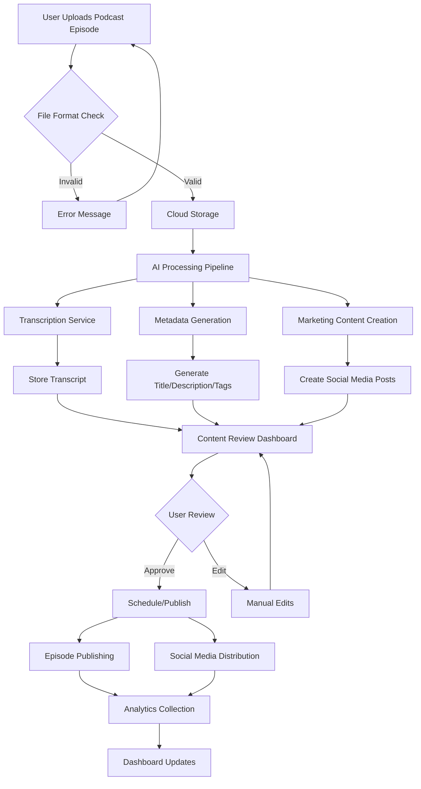
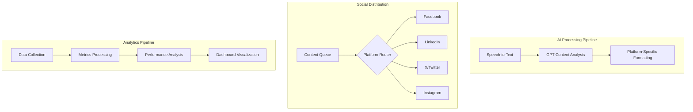
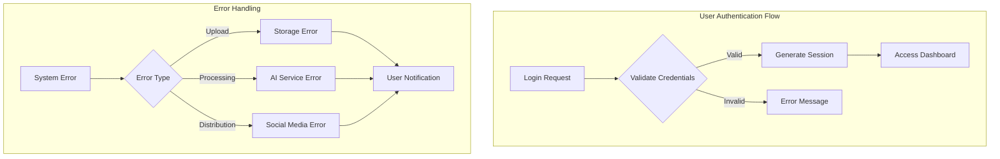
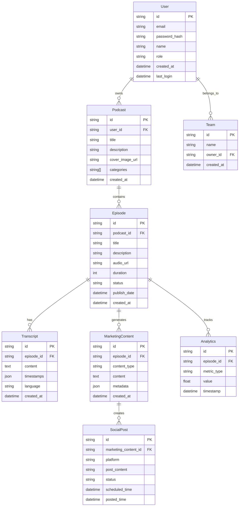
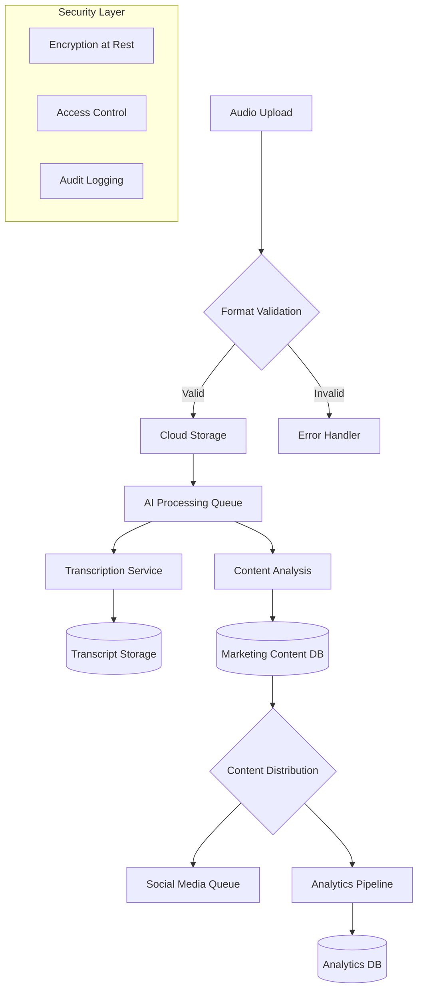
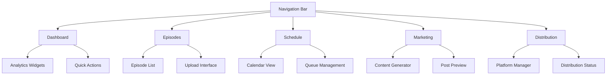
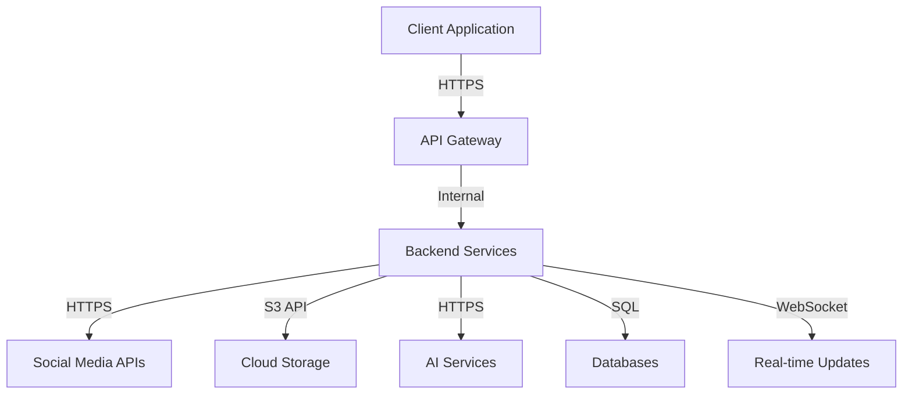

# 1. INTRODUCTION

## 1.1 Purpose

This Software Requirements Specification (SRS) document provides a comprehensive description of the Podcast Marketing Automation SaaS platform. It details the functional and non-functional requirements for developers, project managers, QA teams, and stakeholders involved in the development process. The document serves as the primary reference for technical implementation and validation of the system.

## 1.2 Scope

The Podcast Marketing Automation SaaS platform is a comprehensive solution designed to streamline podcast management and marketing workflows through AI automation. The system encompasses:

- Automated podcast episode management and metadata generation
- AI-powered transcription services
- Intelligent marketing content creation and distribution
- Multi-platform social media integration
- Analytics and performance tracking
- User role management and collaboration features

### 1.2.1 Goals

- Reduce manual effort in podcast publishing and marketing by 80%
- Provide consistent, high-quality marketing content across social platforms
- Enable data-driven decision making through comprehensive analytics
- Streamline collaboration between podcast team members

### 1.2.2 Benefits

- Time savings through automated transcription and content generation
- Increased podcast visibility through optimized multi-channel marketing
- Improved audience engagement through consistent social media presence
- Enhanced podcast performance tracking and analytics
- Reduced operational costs for podcast production teams

### 1.2.3 Core Functionalities

| Feature Category | Key Capabilities |
|-----------------|------------------|
| Podcast Management | Episode upload, metadata generation, publishing controls |
| AI Services | Automated transcription, content generation, tag suggestions |
| Marketing Automation | Social media post creation, scheduling, distribution |
| Analytics | Episode performance metrics, social media engagement tracking |
| Collaboration | Role-based access control, team workflow management |

# 2. PRODUCT DESCRIPTION

## 2.1 Product Perspective

The Podcast Marketing Automation SaaS platform operates as a standalone web application that integrates with multiple external systems and services:

| Integration Type | Systems |
|-----------------|----------|
| Storage Services | Cloud storage for audio files and transcripts |
| Social Platforms | Facebook, LinkedIn, X, Instagram APIs |
| AI Services | GPT for content generation, Speech-to-text for transcription |
| Analytics Services | Social media metrics, podcast hosting statistics |

## 2.2 Product Functions

The system provides the following core functions:

- Podcast Episode Management
  - Audio file upload and storage
  - Automated metadata generation
  - Publishing and scheduling controls
  
- AI-Powered Content Generation
  - Automated transcription
  - Title and description generation
  - Marketing content creation
  
- Marketing Automation
  - Multi-platform social media post scheduling
  - Content optimization per platform
  - Campaign management
  
- Analytics and Reporting
  - Episode performance tracking
  - Social media engagement metrics
  - Growth trend analysis

## 2.3 User Characteristics

### 2.3.1 Primary Users: Podcast Creators/Hosts
- Technical proficiency: Basic to intermediate
- Frequency of use: Daily to weekly
- Key needs: Efficient podcast management and marketing automation
- Typical activities: Episode uploads, content approval, analytics review

### 2.3.2 Secondary Users: Collaborators
- Technical proficiency: Basic
- Frequency of use: Weekly
- Key needs: Content management and basic analytics access
- Typical activities: Content uploads, basic reporting

## 2.4 Constraints

### 2.4.1 Technical Constraints
- Maximum audio file size: 500MB per episode
- Supported audio formats: MP3, WAV
- Browser compatibility: Latest versions of Chrome, Firefox, Safari, Edge
- Mobile responsiveness requirements

### 2.4.2 Regulatory Constraints
- GDPR compliance for EU users
- CCPA compliance for California users
- Data retention policies
- Social media platform guidelines

### 2.4.3 Business Constraints
- Integration with existing podcast hosting platforms
- API rate limits for social media platforms
- Storage costs for audio files
- AI processing limitations

## 2.5 Assumptions and Dependencies

### 2.5.1 Assumptions
- Users have stable internet connectivity
- Users have access to social media accounts
- Audio files meet minimum quality standards
- Users understand basic podcast terminology

### 2.5.2 Dependencies
- Availability of third-party APIs
- Cloud infrastructure reliability
- AI service uptime
- Social media platform API stability
- Payment processing system availability

# 3. PROCESS FLOWCHART

# 4. FUNCTIONAL REQUIREMENTS

## 4.1 Podcast Episode Management

### ID: F-PEM-001
**Description**: Audio file upload and storage system  
**Priority**: High

| Requirement ID | Requirement Description | Acceptance Criteria |
|---------------|------------------------|-------------------|
| F-PEM-001.1 | Support MP3 and WAV file uploads up to 500MB | - Successful upload of files within size limit - Error handling for oversized files - Progress indicator during upload |
| F-PEM-001.2 | Cloud storage integration | - Automatic file backup - Secure file storage - Quick retrieval capabilities |
| F-PEM-001.3 | Episode draft management | - Save/edit draft functionality - Draft preview - Draft status indicator |

### ID: F-PEM-002
**Description**: Episode metadata management  
**Priority**: High

| Requirement ID | Requirement Description | Acceptance Criteria |
|---------------|------------------------|-------------------|
| F-PEM-002.1 | AI-generated metadata suggestions | - Title generation - Description creation - Tag recommendations |
| F-PEM-002.2 | Manual metadata editing | - Edit interface for all metadata fields - Character count limits - Save/cancel options |
| F-PEM-002.3 | Publishing schedule control | - Date/time selector - Time zone support - Schedule modification options |

## 4.2 AI Services

### ID: F-AI-001
**Description**: Automated transcription service  
**Priority**: High

| Requirement ID | Requirement Description | Acceptance Criteria |
|---------------|------------------------|-------------------|
| F-AI-001.1 | Speech-to-text conversion | - 95%+ accuracy rate - Support for multiple accents - Punctuation inclusion |
| F-AI-001.2 | Transcript editing interface | - Text editor with timestamps - Search/replace functionality - Export options |
| F-AI-001.3 | Speaker detection | - Automatic speaker labeling - Speaker name editing - Consistent speaker tracking |

### ID: F-AI-002
**Description**: Content generation system  
**Priority**: Medium

| Requirement ID | Requirement Description | Acceptance Criteria |
|---------------|------------------------|-------------------|
| F-AI-002.1 | Marketing content creation | - Platform-specific post generation - Hashtag suggestions - Key quote extraction |
| F-AI-002.2 | Content optimization | - Character limit compliance - Platform-specific formatting - Media attachment support |

## 4.3 Marketing Automation

### ID: F-MA-001
**Description**: Social media integration  
**Priority**: High

| Requirement ID | Requirement Description | Acceptance Criteria |
|---------------|------------------------|-------------------|
| F-MA-001.1 | Platform authentication | - OAuth integration - Account linking - Connection status monitoring |
| F-MA-001.2 | Post scheduling | - Multi-platform scheduling - Queue management - Conflict detection |
| F-MA-001.3 | Content distribution | - Automated posting - Failure notifications - Retry mechanisms |

## 4.4 Analytics

### ID: F-AN-001
**Description**: Performance tracking system  
**Priority**: Medium

| Requirement ID | Requirement Description | Acceptance Criteria |
|---------------|------------------------|-------------------|
| F-AN-001.1 | Episode metrics | - Download tracking - Listener demographics - Engagement rates |
| F-AN-001.2 | Social media analytics | - Post performance metrics - Engagement statistics - Click-through tracking |
| F-AN-001.3 | Custom reporting | - Date range selection - Export functionality - Visual data representation |

## 4.5 User Management

### ID: F-UM-001
**Description**: Authentication and authorization system  
**Priority**: High

| Requirement ID | Requirement Description | Acceptance Criteria |
|---------------|------------------------|-------------------|
| F-UM-001.1 | User registration/login | - Email verification - Password requirements - Social login options |
| F-UM-001.2 | Role management | - Role assignment - Permission settings - Access control |
| F-UM-001.3 | Team collaboration | - User invitations - Role-based access - Activity logging |

# 5. NON-FUNCTIONAL REQUIREMENTS

## 5.1 Performance Requirements

| Requirement | Specification | Success Criteria |
|------------|---------------|------------------|
| Response Time | - Page load time < 2 seconds - API response time < 500ms - File upload processing < 5 seconds per 10MB | - 95th percentile of requests meet criteria - Monitoring shows consistent performance |
| Throughput | - Support 1000 concurrent users - Handle 100 simultaneous file uploads - Process 10,000 API requests/minute | - Load testing validates capacity - No degradation under peak load |
| Resource Usage | - CPU utilization < 70% - Memory usage < 80% - Storage optimization with compression | - Resource monitoring within limits - Efficient resource scaling |

## 5.2 Safety Requirements

| Category | Requirement | Implementation |
|----------|-------------|----------------|
| Data Backup | - Automated daily backups - 30-day backup retention - Multi-region redundancy | - Cloud backup systems - Versioning enabled - Geographic distribution |
| Failure Recovery | - Maximum 15-minute recovery time - Automatic failover systems - Data consistency checks | - Disaster recovery plan - System health monitoring - Automated recovery procedures |
| Error Handling | - Graceful degradation of services - User notification system - Transaction rollback capability | - Error logging and tracking - User-friendly error messages - Data integrity preservation |

## 5.3 Security Requirements

| Area | Specification | Validation Criteria |
|------|---------------|-------------------|
| Authentication | - Multi-factor authentication - OAuth 2.0 integration - Session management | - Security audit compliance - Penetration testing - Regular security reviews |
| Data Protection | - AES-256 encryption at rest - TLS 1.3 for data in transit - Regular security scans | - Encryption verification - Security certificates - Vulnerability assessments |
| Access Control | - Role-based access control (RBAC) - IP whitelisting option - Audit logging | - Permission matrix validation - Access attempt monitoring - Regular audit reviews |

## 5.4 Quality Requirements

### 5.4.1 Availability
- 99.9% uptime guarantee
- Scheduled maintenance windows
- Real-time status monitoring

### 5.4.2 Maintainability
- Modular architecture
- Comprehensive documentation
- Automated testing coverage > 80%

### 5.4.3 Usability
- Mobile-responsive design
- WCAG 2.1 AA compliance
- Maximum 3 clicks to core features

### 5.4.4 Scalability
- Horizontal scaling capability
- Auto-scaling based on load
- Microservices architecture support

### 5.4.5 Reliability
- Mean Time Between Failures (MTBF) > 720 hours
- Mean Time To Recovery (MTTR) < 30 minutes
- Zero data loss guarantee

## 5.5 Compliance Requirements

| Regulation | Requirements | Implementation |
|------------|--------------|----------------|
| GDPR | - Data processing consent - Right to erasure - Data portability | - Consent management system - Data deletion workflows - Export functionality |
| CCPA | - Privacy policy compliance - Data collection disclosure - Opt-out mechanisms | - Privacy controls - Data tracking system - User preference center |
| Industry Standards | - OAuth 2.0 compliance - ISO 27001 alignment - SOC 2 Type II certification | - Security framework implementation - Regular audits - Certification maintenance |

# 6. DATA REQUIREMENTS

## 6.1 Data Models

## 6.2 Data Storage

### 6.2.1 Storage Systems

| Data Type | Storage System | Retention Period |
|-----------|---------------|------------------|
| User Data | PostgreSQL | Indefinite |
| Audio Files | Cloud Object Storage | 7 years |
| Transcripts | PostgreSQL | 7 years |
| Analytics Data | TimescaleDB | 2 years |
| Marketing Content | PostgreSQL | 2 years |
| Social Posts | PostgreSQL | 1 year |

### 6.2.2 Backup and Recovery

| Backup Type | Frequency | Retention | Recovery Time Objective |
|-------------|-----------|-----------|------------------------|
| Full Database | Daily | 30 days | 1 hour |
| Incremental | Hourly | 7 days | 15 minutes |
| Audio Files | Real-time replication | 30 days | 30 minutes |
| Configuration | Daily | 90 days | 15 minutes |

### 6.2.3 Data Redundancy

- Geographic replication across three regions
- Active-passive database configuration
- Multi-zone storage distribution for audio files
- Real-time synchronization between storage zones

## 6.3 Data Processing

### 6.3.1 Data Security Measures

| Security Layer | Implementation | Validation |
|----------------|----------------|------------|
| Encryption | AES-256 for storage, TLS 1.3 for transit | Regular security audits |
| Access Control | Role-based permissions, API keys | Access logs review |
| Data Masking | PII encryption, Tokenization | Compliance checks |
| Audit Trail | Activity logging, Change tracking | Monthly reviews |

### 6.3.2 Data Processing Workflows

| Process | Components | SLA |
|---------|------------|-----|
| Audio Processing | File validation, Transcoding, Storage | < 5 minutes |
| Transcription | Speech-to-text, Format conversion | < 10 minutes |
| Content Generation | AI analysis, Platform formatting | < 3 minutes |
| Analytics Processing | Data collection, Aggregation, Storage | Real-time |

### 6.3.3 Data Retention Policies

| Data Category | Active Storage | Archive Storage | Deletion Policy |
|---------------|----------------|-----------------|-----------------|
| User Content | 2 years | 5 years | On request |
| System Logs | 90 days | 1 year | Automatic |
| Analytics | 6 months | 18 months | Automatic |
| Marketing Data | 1 year | 1 year | Automatic |

# 7. EXTERNAL INTERFACES

## 7.1 User Interfaces

### 7.1.1 General Requirements

| Component | Requirement | Implementation |
|-----------|-------------|----------------|
| Responsive Design | - Support for desktop (1920x1080) to mobile (320px min-width) - Fluid layouts with breakpoints - Touch-friendly controls | React + TailwindCSS |
| Theme Support | - Light/Dark mode toggle - System preference detection - Consistent color palette | ShadCN theming system |
| Accessibility | - WCAG 2.1 AA compliance - Screen reader compatibility - Keyboard navigation | ARIA attributes, semantic HTML |

### 7.1.2 Core Interface Components

## 7.2 Software Interfaces

### 7.2.1 External Service Integration

| Service Type | Interface | Protocol | Data Format |
|-------------|-----------|----------|-------------|
| Social Media APIs | REST APIs | HTTPS | JSON |
| Cloud Storage | AWS S3 API | HTTPS | Binary/JSON |
| AI Services | GPT API | HTTPS | JSON |
| Analytics Services | GraphQL | HTTPS | JSON |

### 7.2.2 Database Interfaces

| Database | Interface Type | Purpose | Connection Method |
|----------|---------------|---------|-------------------|
| PostgreSQL | SQL | Primary data storage | Connection pooling |
| TimescaleDB | SQL | Time-series analytics | Direct connection |
| Redis | Key-Value | Caching, queues | Connection pool |

## 7.3 Communication Interfaces

### 7.3.1 Network Protocols

| Protocol | Usage | Security |
|----------|--------|----------|
| HTTPS | All API communications | TLS 1.3 |
| WebSocket | Real-time updates | WSS (Secure WebSocket) |
| SMTP | Email notifications | TLS encryption |

### 7.3.2 API Specifications

| API Category | Format | Rate Limits | Authentication |
|--------------|--------|-------------|----------------|
| REST APIs | JSON | 1000 req/min | JWT tokens |
| WebSocket | JSON | 100 msg/sec | Socket tokens |
| File Upload | Multipart | 500MB max | Pre-signed URLs |

### 7.3.3 Integration Points

## 7.4 Hardware Interfaces

### 7.4.1 Storage Requirements

| Component | Interface Type | Specifications |
|-----------|---------------|----------------|
| Audio Processing | Block Storage | - Min 100MB/s read/write - Low latency access - SSD backing |
| File Storage | Object Storage | - High throughput - Geographic distribution - Redundancy support |

### 7.4.2 Processing Requirements

| Resource | Specification | Purpose |
|----------|--------------|---------|
| CPU | Multi-core support | Parallel processing of audio files |
| Memory | High-speed access | AI model operations |
| Network | 10Gbps minimum | Large file transfers |

# 8. APPENDICES

## 8.1 GLOSSARY

| Term | Definition |
|------|------------|
| Podcast | Digital audio content distributed in episodes via the internet |
| Metadata | Descriptive information about podcast episodes including title, description, and tags |
| Transcription | The process of converting spoken audio content into written text |
| Marketing Content | Social media posts, descriptions, and promotional materials created to market podcast episodes |
| Content Queue | A scheduled list of social media posts waiting to be published |
| Analytics | Quantitative data about podcast and marketing performance |
| Draft | Unpublished podcast episode or marketing content saved for later editing |
| Webhook | Automated message sent from one application to another when specific events occur |

## 8.2 ACRONYMS

| Acronym | Definition |
|---------|------------|
| API | Application Programming Interface |
| CCPA | California Consumer Privacy Act |
| GDPR | General Data Protection Regulation |
| GPT | Generative Pre-trained Transformer |
| JWT | JSON Web Token |
| MTBF | Mean Time Between Failures |
| MTTR | Mean Time To Recovery |
| OAuth | Open Authorization |
| RBAC | Role-Based Access Control |
| REST | Representational State Transfer |
| SaaS | Software as a Service |
| SLA | Service Level Agreement |
| TLS | Transport Layer Security |
| UI | User Interface |
| WCAG | Web Content Accessibility Guidelines |
| WSS | WebSocket Secure |

## 8.3 ADDITIONAL REFERENCES

| Category | Reference | Purpose |
|----------|-----------|----------|
| Social Media APIs | [Facebook Graph API Documentation](https://developers.facebook.com/docs/graph-api/) | Integration reference for Facebook posting |
| Social Media APIs | [Twitter API Documentation](https://developer.twitter.com/en/docs) | Integration reference for X/Twitter posting |
| Social Media APIs | [LinkedIn API Documentation](https://developer.linkedin.com/docs) | Integration reference for LinkedIn posting |
| AI Services | [OpenAI API Documentation](https://platform.openai.com/docs) | Reference for GPT integration |
| Cloud Services | [AWS S3 Documentation](https://docs.aws.amazon.com/s3/) | Reference for file storage implementation |
| Security Standards | [OWASP Security Guidelines](https://owasp.org/www-project-web-security-testing-guide/) | Security implementation reference |
| Accessibility | [WCAG 2.1 Guidelines](https://www.w3.org/WAI/standards-guidelines/wcag/) | Accessibility implementation reference |
| Database | [TimescaleDB Documentation](https://docs.timescale.com/) | Time-series data implementation |
| Frontend Framework | [React Documentation](https://reactjs.org/docs/) | UI implementation reference |
| UI Components | [ShadcN Documentation](https://ui.shadcn.com/) | Component library reference |