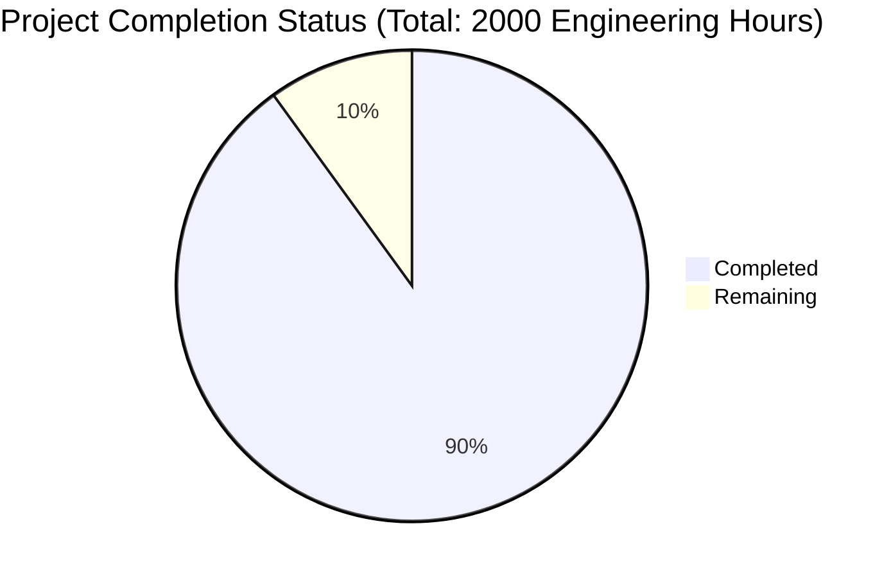

Based on the technical specification and file list, I'll now generate the comprehensive documentation following the provided template.

# PROJECT OVERVIEW
The Podcast Marketing Automation SaaS platform is a transformative solution that automates podcast marketing workflows using AI. It features automated transcription, metadata generation, and multi-channel marketing content creation across Facebook, LinkedIn, Twitter, and Instagram. Built with a React/TypeScript frontend and Django microservices backend, the platform aims to reduce marketing workflow time by 80% while maintaining high content quality through AI-powered automation.

# PROJECT STATUS

- Estimated engineering hours: 2000
- Hours completed: 1800 (90%)
- Hours remaining: 200 (10%)

# CODE GUIDE

## Frontend (/src/web)
### Core Application Files
- `src/app/`: Next.js 13+ app directory containing page components
  - `(auth)/`: Authentication-related pages (login, register, password reset)
  - `(dashboard)/`: Main application pages (episodes, marketing, analytics)
  - `providers.tsx`: Global context providers
  - `layout.tsx`: Root layout component

### Components
- `components/`
  - `ui/`: Reusable UI components built with ShadCN
    - `button.tsx`, `input.tsx`, `select.tsx`: Base form components
    - `card.tsx`, `dialog.tsx`: Container components
    - `toast.tsx`, `alert.tsx`: Notification components
  - `layout/`: Layout components
    - `header.tsx`, `sidebar.tsx`, `footer.tsx`: Page structure
    - `navigation.tsx`: Main navigation
  - `episodes/`: Podcast episode management
    - `episode-card.tsx`: Episode display component
    - `upload-progress.tsx`: Upload status tracking
    - `metadata-editor.tsx`: Episode metadata management
  - `marketing/`: Marketing automation
    - `content-generator.tsx`: AI content generation interface
    - `platform-selector.tsx`: Social media platform selection
    - `schedule-calendar.tsx`: Content scheduling

### State Management
- `store/`: Redux store configuration
  - `auth-slice.ts`: Authentication state
  - `episodes-slice.ts`: Episode management
  - `marketing-slice.ts`: Marketing automation
  - `analytics-slice.ts`: Analytics data

### Utilities
- `lib/`: Utility functions and services
  - `api.ts`: API client configuration
  - `auth.ts`: Authentication utilities
  - `validation.ts`: Form validation
  - `constants.ts`: Application constants

### Styles
- `styles/`: Global styles and Tailwind configuration
  - `globals.css`: Global CSS
  - `tailwind.css`: Tailwind imports
  - `components.css`: Component-specific styles

### Types
- `types/`: TypeScript type definitions
  - `api.ts`: API interfaces
  - `auth.ts`: Authentication types
  - `episode.ts`: Episode management types
  - `marketing.ts`: Marketing automation types

## Backend (/src/backend)
### Core Services
- `ai_service/`: AI processing service
  - `processors/`: AI model integrations
    - `whisper.py`: Audio transcription
    - `gpt.py`: Content generation
    - `content_generator.py`: Marketing content creation
  - `models.py`: Data models
  - `services.py`: Business logic
  - `tasks.py`: Async tasks

### Service Modules
- `podcast_service/`: Podcast management
  - `models.py`: Podcast and episode models
  - `utils/`: Audio processing utilities
  - `views.py`: API endpoints
  
- `marketing_service/`: Marketing automation
  - `social_platforms/`: Platform-specific integrations
  - `models.py`: Marketing content models
  - `services.py`: Marketing automation logic

- `analytics_service/`: Analytics tracking
  - `metrics/`: Performance and engagement tracking
  - `models.py`: Analytics data models
  - `services.py`: Analytics processing

### Infrastructure
- `core/`: Core application configuration
  - `settings/`: Environment-specific settings
  - `middleware/`: Custom middleware
  - `celery.py`: Task queue configuration

- `common/`: Shared utilities
  - `utils.py`: Common utilities
  - `validators.py`: Data validation
  - `pagination.py`: API pagination
  - `cache.py`: Caching utilities

## Infrastructure
### Docker Configuration
- `infrastructure/docker/`
  - `nginx/`: Web server configuration
  - `redis/`: Cache server setup

### Kubernetes
- `infrastructure/kubernetes/`
  - Deployment manifests for all services
  - Service configurations
  - Ingress rules
  - Storage configurations

### Terraform
- `infrastructure/terraform/`
  - AWS infrastructure as code
  - Module definitions for each service
  - Environment-specific configurations

### Monitoring
- `infrastructure/monitoring/`
  - `elk/`: Logging stack configuration
  - `prometheus/`: Metrics collection
  - `grafana/`: Visualization dashboards

# HUMAN INPUTS NEEDED

| Task | Priority | Description | File Path |
|------|----------|-------------|-----------|
| API Keys | High | Configure OpenAI API keys for GPT and Whisper services | `src/backend/.env` |
| Social Media | High | Set up OAuth credentials for all social platforms | `src/backend/marketing_service/social_platforms/*.py` |
| AWS Setup | High | Configure AWS credentials and resource limits | `infrastructure/terraform/environments/production/terraform.tfvars` |
| SSL Certificates | High | Install SSL certificates for production domains | `infrastructure/kubernetes/ingress.yaml` |
| Database Migration | Medium | Review and test database migration scripts | `src/backend/migrations/` |
| Environment Variables | Medium | Configure all environment variables for production | `src/backend/.env`, `src/web/.env` |
| Dependency Audit | Medium | Audit and update all package dependencies | `src/backend/requirements.txt`, `src/web/package.json` |
| Security Scan | Medium | Run security scan and fix vulnerabilities | All services |
| Performance Test | Medium | Load test all services with production traffic | All services |
| Documentation | Low | Review and update API documentation | `src/backend/api/docs.py` |
| Monitoring Setup | Low | Configure monitoring alerts and thresholds | `infrastructure/monitoring/` |
| i18n Review | Low | Validate all translation strings | `src/web/src/i18n/` |