# 1. INTRODUCTION

## 1.1 Executive Summary

The Podcast Marketing Automation SaaS platform represents a transformative solution in the podcast industry, addressing the significant challenge of time-consuming manual marketing processes that podcast creators face. The system leverages artificial intelligence to automate podcast transcription, metadata generation, and multi-channel marketing content creation, enabling creators to focus on content production while maintaining a consistent social media presence.

This platform serves podcast creators, marketing teams, and content collaborators by reducing marketing workflow time by up to 80% while increasing social media engagement through AI-optimized content distribution across multiple platforms. The solution positions itself as an essential tool in the podcast creation workflow, bridging the gap between content production and effective marketing distribution.

## 1.2 System Overview

### Project Context

| Aspect | Description |
|--------|-------------|
| Market Position | First-to-market AI-driven podcast marketing automation platform |
| Target Market | Independent podcast creators and professional podcast networks |
| Competitive Edge | End-to-end automation of podcast marketing workflow |
| Enterprise Integration | Compatible with major podcast hosting platforms and social media networks |

### High-Level Description

| Component | Implementation |
|-----------|----------------|
| Frontend Architecture | React-based SPA with TailwindCSS and ShadCN |
| Backend Services | Django REST API with microservices architecture |
| AI Integration | GPT for content generation, custom ML models for audio processing |
| Storage Solutions | Cloud-based distributed storage for audio files and transcripts |
| Security Framework | OAuth 2.0, JWT authentication, end-to-end encryption |

### Success Criteria

| Metric | Target |
|--------|--------|
| Marketing Workflow Time Reduction | 80% decrease in time spent on marketing tasks |
| User Adoption | 10,000 active podcast creators within 6 months |
| Content Generation Accuracy | 95% acceptance rate of AI-generated content |
| System Availability | 99.9% uptime |
| User Satisfaction | Net Promoter Score (NPS) > 50 |

## 1.3 Scope

### In-Scope Elements

#### Core Features and Functionalities

| Category | Features |
|----------|-----------|
| Podcast Management | - Audio file upload and processing<br>- Metadata generation and management<br>- Episode scheduling and publishing |
| AI Services | - Automated transcription<br>- Content summarization<br>- Marketing copy generation |
| Marketing Automation | - Multi-platform post scheduling<br>- Content optimization<br>- Campaign analytics |
| User Management | - Role-based access control<br>- Team collaboration<br>- Activity tracking |

#### Implementation Boundaries

| Boundary Type | Coverage |
|--------------|----------|
| User Groups | Podcast creators, marketing teams, content collaborators |
| Geographic Coverage | Global deployment with multi-language support |
| Supported Platforms | Facebook, LinkedIn, X (Twitter), Instagram |
| Data Processing | Audio files up to 500MB, all major podcast formats |

### Out-of-Scope Elements

| Category | Excluded Elements |
|----------|------------------|
| Features | - Video podcast processing<br>- Live streaming capabilities<br>- Direct podcast hosting<br>- E-commerce integration |
| Integrations | - Traditional media distribution<br>- Custom social media platforms<br>- Direct advertising platforms |
| Support | - 24/7 phone support<br>- On-premise deployment<br>- Custom hardware integration |
| Future Considerations | - Podcast network management<br>- Advanced analytics dashboards<br>- Automated video content generation |

# 7. SYSTEM ARCHITECTURE

## 7.1 High-Level Architecture

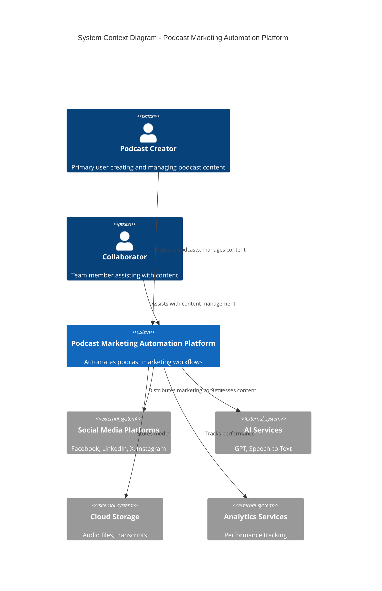

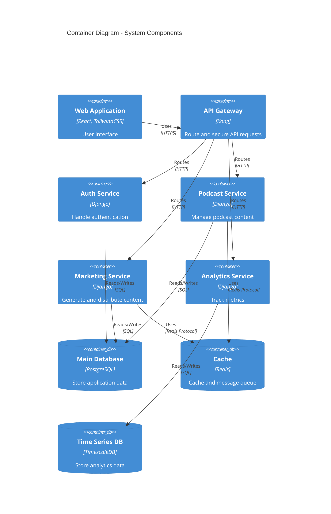

## 7.2 Component Details

### 7.2.1 Core Components

| Component | Purpose | Technology Stack | Scaling Strategy |
|-----------|---------|-----------------|------------------|
| Web Application | User interface | React, TailwindCSS, ShadCN | Horizontal scaling with CDN |
| API Gateway | Request routing, security | Kong | Horizontal scaling with load balancing |
| Auth Service | Authentication, authorization | Django, JWT | Horizontal scaling with session replication |
| Podcast Service | Content management | Django, Celery | Horizontal scaling with queue distribution |
| Marketing Service | Content generation, distribution | Django, GPT | Horizontal scaling with job distribution |
| Analytics Service | Metrics collection, analysis | Django, Pandas | Horizontal scaling with data partitioning |

### 7.2.2 Data Storage Components

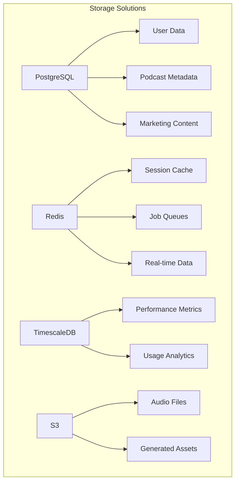

## 7.3 Technical Decisions

### 7.3.1 Architecture Patterns

| Pattern | Implementation | Justification |
|---------|---------------|---------------|
| Microservices | Service-based decomposition | Enables independent scaling and deployment |
| Event-Driven | Redis pub/sub, message queues | Asynchronous processing for better performance |
| CQRS | Separate read/write models | Optimized data access patterns |
| API Gateway | Kong with JWT authentication | Centralized security and routing |

### 7.3.2 Communication Patterns

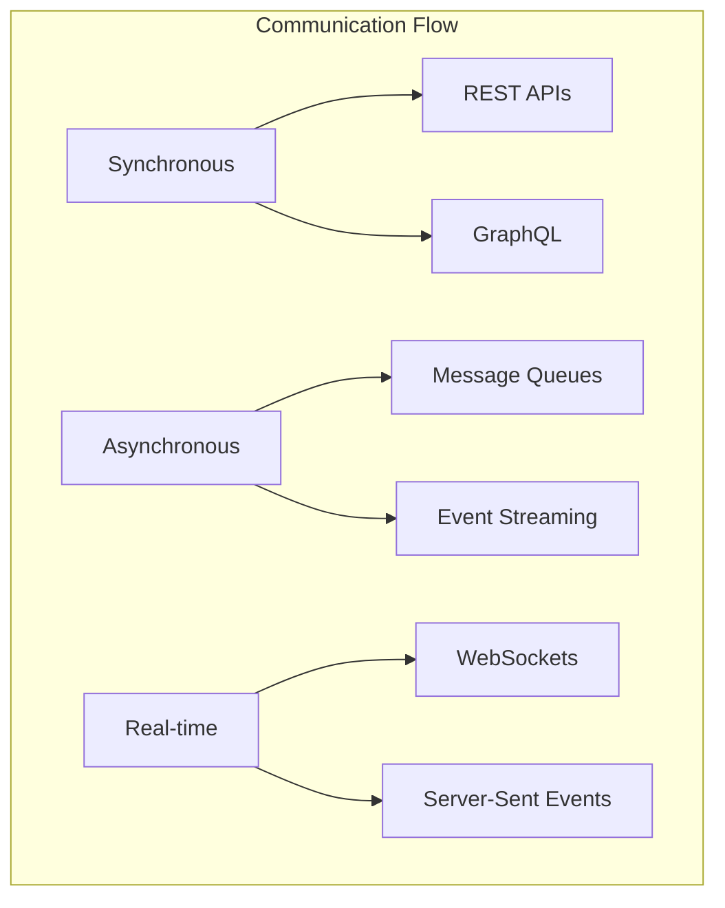

## 7.4 Cross-Cutting Concerns

### 7.4.1 Monitoring and Observability

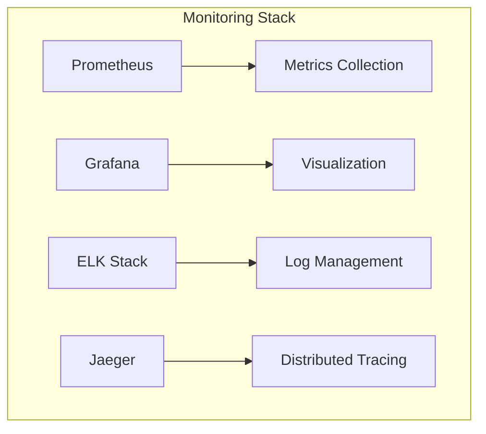

### 7.4.2 Security Architecture

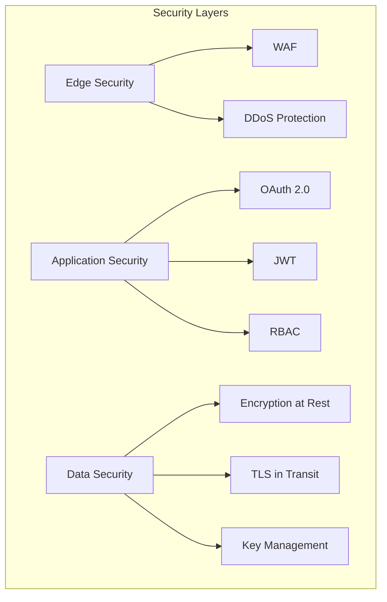

## 7.5 Deployment Architecture

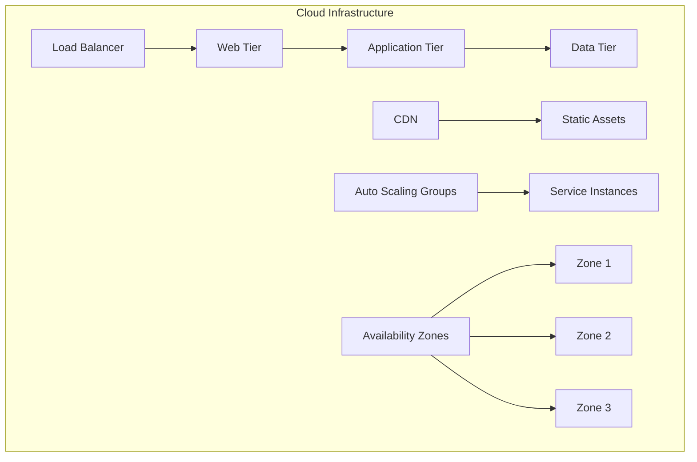

### 7.5.1 Infrastructure Requirements

| Component | Specification | Redundancy |
|-----------|--------------|------------|
| Web Tier | t3.medium instances | Multi-AZ with auto-scaling |
| Application Tier | t3.large instances | Multi-AZ with auto-scaling |
| Database | db.r5.xlarge | Multi-AZ with read replicas |
| Cache | cache.r5.large | Multi-AZ cluster |
| Storage | General Purpose SSD | Cross-region replication |

### 7.5.2 Disaster Recovery

| Aspect | Strategy | RTO/RPO |
|--------|----------|---------|
| Data Backup | Daily full, hourly incremental | RPO: 1 hour |
| System Recovery | Multi-region failover | RTO: 15 minutes |
| Service Continuity | Active-active deployment | Zero downtime |
| Data Replication | Real-time synchronization | Near real-time |

# 8. SYSTEM DESIGN

## 8.1 User Interface Design

### 8.1.1 Design Specifications

| Aspect | Requirements | Implementation |
|--------|--------------|----------------|
| Visual Hierarchy | - F-pattern layout for content<br>- Z-pattern for CTAs<br>- Consistent spacing (8px grid) | TailwindCSS spacing system |
| Component Library | - ShadCN UI components<br>- Custom podcast-specific components<br>- Reusable design tokens | React + ShadCN |
| Responsive Design | - Mobile-first approach<br>- Breakpoints: 320px, 768px, 1024px, 1440px<br>- Fluid typography | TailwindCSS responsive classes |
| Accessibility | - WCAG 2.1 AA compliance<br>- ARIA labels<br>- Keyboard navigation<br>- Screen reader support | React-Aria integration |
| Browser Support | - Chrome 90+<br>- Firefox 88+<br>- Safari 14+<br>- Edge 90+ | Autoprefixer, Babel |
| Theme Support | - System preference detection<br>- Manual toggle<br>- Persistent preference storage | TailwindCSS dark mode |
| i18n | - RTL support<br>- Dynamic content translation<br>- Date/time localization | React-i18next |

### 8.1.2 Interface Elements

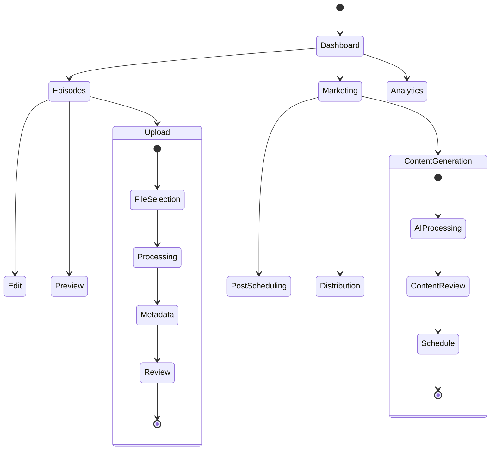

### 8.1.3 Critical User Flows

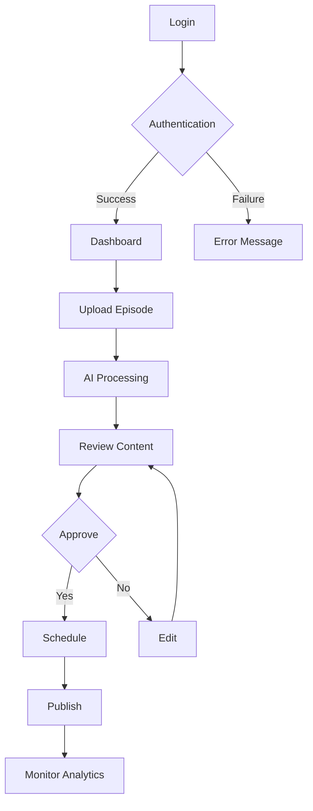

## 8.2 Database Design

### 8.2.1 Schema Design

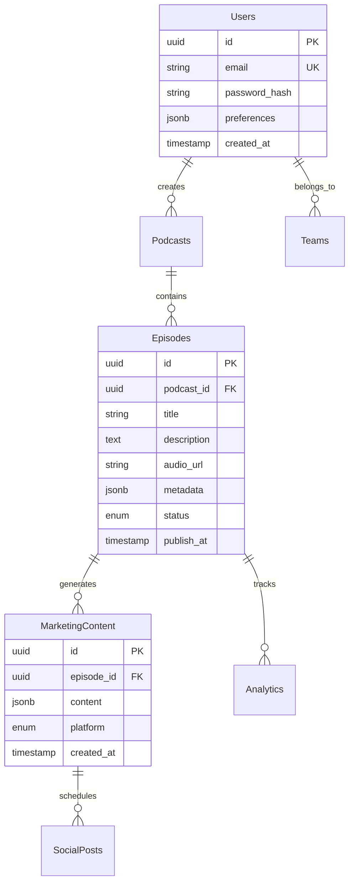

### 8.2.2 Data Management Strategy

| Aspect | Strategy | Implementation |
|--------|----------|----------------|
| Migrations | - Versioned migrations<br>- Rollback support<br>- Data validation | Django migrations |
| Versioning | - Schema versioning<br>- API versioning alignment<br>- Backward compatibility | Semantic versioning |
| Archival | - Automated archival after 2 years<br>- Compressed storage<br>- Searchable archive | PostgreSQL partitioning |
| Retention | - Legal compliance<br>- Cost optimization<br>- Performance balance | Policy enforcement |
| Privacy | - Data encryption<br>- Access controls<br>- GDPR compliance | Row-level security |
| Audit | - Change tracking<br>- Access logging<br>- Error logging | Audit trigger functions |

## 8.3 API Design

### 8.3.1 API Architecture

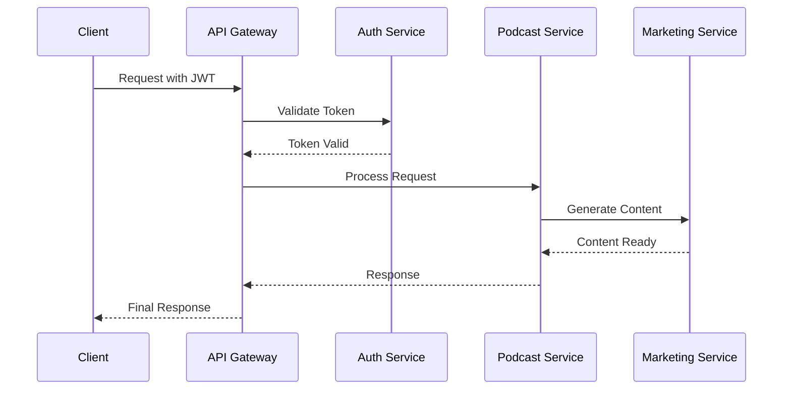

### 8.3.2 Interface Specifications

| Endpoint | Method | Purpose | Request Format | Response Format |
|----------|--------|---------|----------------|-----------------|
| /api/v1/episodes | POST | Create episode | Multipart/form-data | JSON |
| /api/v1/episodes/{id} | GET | Retrieve episode | - | JSON |
| /api/v1/marketing/generate | POST | Generate content | JSON | JSON |
| /api/v1/social/schedule | POST | Schedule posts | JSON | JSON |

### 8.3.3 Integration Requirements

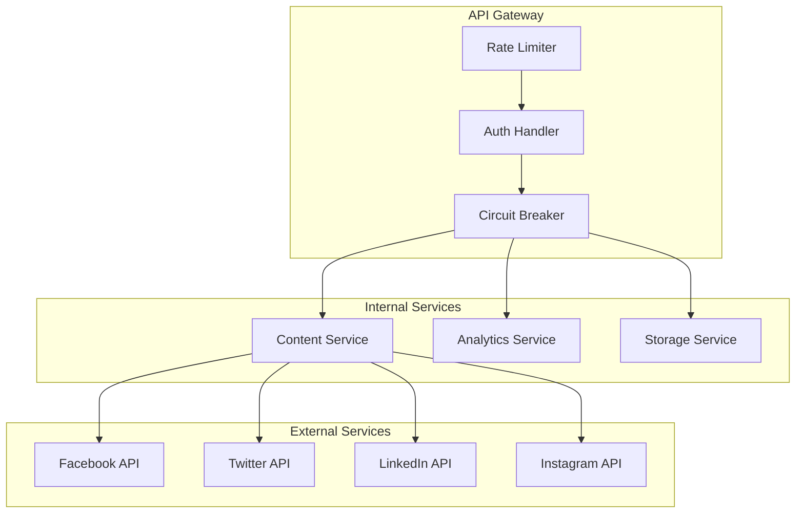

### 8.3.4 API Security Controls

| Control | Implementation | Purpose |
|---------|----------------|---------|
| Authentication | JWT tokens | Identity verification |
| Authorization | RBAC | Access control |
| Rate Limiting | Token bucket | Abuse prevention |
| Input Validation | JSON Schema | Data integrity |
| Error Handling | RFC 7807 | Consistent errors |
| SSL/TLS | TLS 1.3 | Transport security |

# 9. TECHNOLOGY STACK

## 9.1 PROGRAMMING LANGUAGES

| Platform/Component | Language | Version | Justification |
|-------------------|----------|---------|---------------|
| Backend | Python | 3.11+ | - Strong AI/ML library ecosystem<br>- Excellent async support<br>- Django's mature ecosystem |
| Frontend | TypeScript | 5.0+ | - Type safety for large-scale application<br>- Enhanced developer experience<br>- Better maintainability |
| Infrastructure | HCL | 1.0+ | - Native Terraform support<br>- Infrastructure as Code best practices |
| Database Migrations | SQL | ANSI SQL:2016 | - PostgreSQL compatibility<br>- Complex query optimization |

## 9.2 FRAMEWORKS & LIBRARIES

### 9.2.1 Core Frameworks

| Component | Framework | Version | Purpose |
|-----------|-----------|---------|----------|
| Backend API | Django | 4.2+ | - Built-in admin interface<br>- Robust ORM<br>- Security features |
| REST Framework | Django REST | 3.14+ | - API serialization<br>- Authentication support<br>- Viewset abstractions |
| Frontend SPA | React | 18+ | - Component reusability<br>- Virtual DOM performance<br>- Large ecosystem |
| UI Components | ShadCN | 1.0+ | - Accessible components<br>- Customizable theming<br>- TypeScript support |
| CSS Framework | TailwindCSS | 3.3+ | - Utility-first approach<br>- Performance optimization<br>- Responsive design |

### 9.2.2 Supporting Libraries

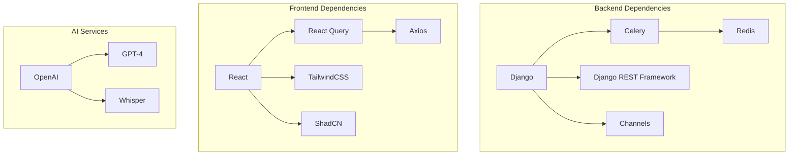

## 9.3 DATABASES & STORAGE

### 9.3.1 Database Architecture

| Type | Technology | Version | Usage |
|------|------------|---------|--------|
| Primary Database | PostgreSQL | 15+ | - User data<br>- Podcast metadata<br>- Marketing content |
| Time Series Data | TimescaleDB | 2.11+ | - Analytics<br>- Performance metrics |
| Caching Layer | Redis | 7.0+ | - Session management<br>- Task queue<br>- Real-time updates |
| Object Storage | AWS S3 | - | - Audio files<br>- Generated assets |

### 9.3.2 Data Flow Architecture

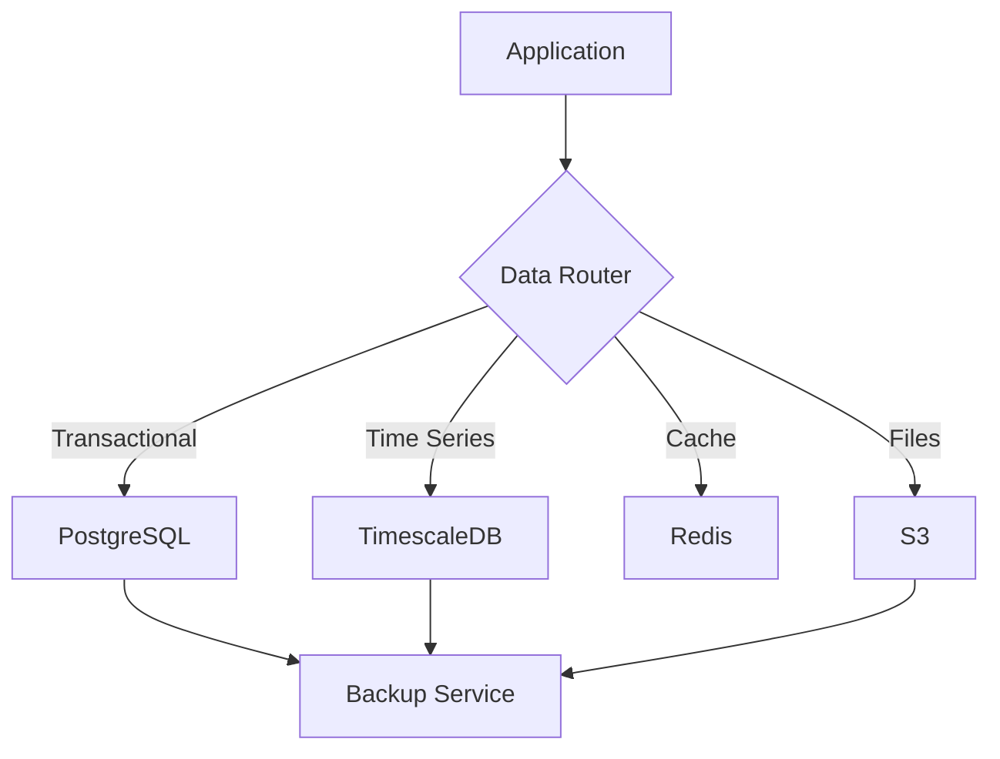

## 9.4 THIRD-PARTY SERVICES

| Category | Service | Purpose | Integration Method |
|----------|---------|---------|-------------------|
| AI/ML | OpenAI GPT-4 | Content generation | REST API |
| Speech-to-Text | OpenAI Whisper | Transcription | REST API |
| Social Media | Facebook Graph API | Post management | OAuth 2.0 |
| Social Media | Twitter API v2 | Tweet scheduling | OAuth 2.0 |
| Analytics | Prometheus | Metrics collection | HTTP endpoint |
| Monitoring | Grafana | Visualization | HTTP API |
| Error Tracking | Sentry | Error monitoring | SDK integration |

## 9.5 DEVELOPMENT & DEPLOYMENT

### 9.5.1 Development Environment

| Tool | Version | Purpose |
|------|---------|----------|
| Docker | 24+ | Container runtime |
| Docker Compose | 2.20+ | Local development |
| Poetry | 1.5+ | Python dependency management |
| pnpm | 8+ | Node.js package management |
| Pre-commit | 3.3+ | Code quality checks |

### 9.5.2 CI/CD Pipeline

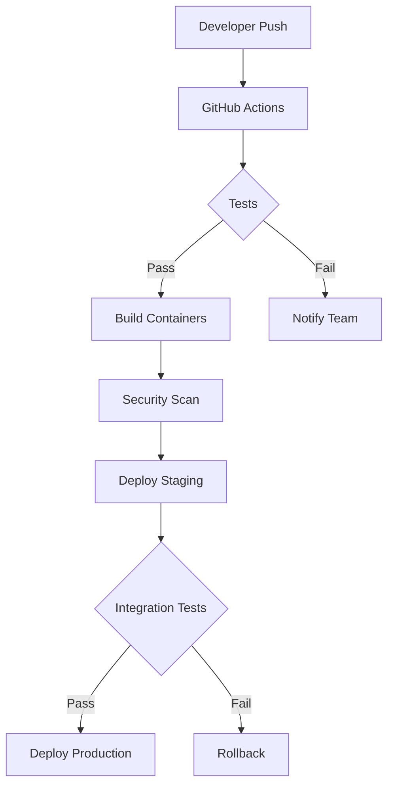

### 9.5.3 Infrastructure

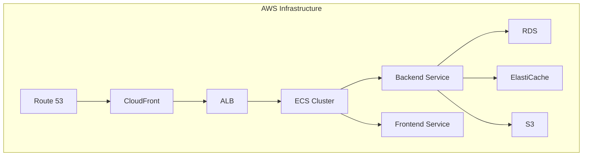

### 9.5.4 Monitoring Stack

| Component | Technology | Metrics |
|-----------|------------|---------|
| APM | New Relic | - Response times<br>- Error rates<br>- Transaction traces |
| Infrastructure | Prometheus | - Resource utilization<br>- Service health<br>- Custom metrics |
| Logging | ELK Stack | - Application logs<br>- System logs<br>- Audit trails |
| Alerting | PagerDuty | - Service incidents<br>- Performance alerts<br>- Security events |

Based on the provided documentation, I'll generate the SYSTEM DESIGN section focusing on UI, Database, and API design since this is a user-facing SaaS platform. I'll maintain consistency with the React/TailwindCSS/ShadCN frontend and Django/PostgreSQL backend choices.

# 8. SYSTEM DESIGN

## 8.1 User Interface Design

### 8.1.1 Design Specifications

| Aspect | Requirements | Implementation |
|--------|--------------|----------------|
| Visual Hierarchy | - F-pattern layout for content<br>- Z-pattern for CTAs<br>- Consistent spacing (8px grid) | TailwindCSS spacing system |
| Component Library | - ShadCN UI components<br>- Custom podcast-specific components<br>- Reusable design tokens | React + ShadCN |
| Responsive Design | - Mobile-first approach<br>- Breakpoints: 320px, 768px, 1024px, 1440px<br>- Fluid typography | TailwindCSS responsive classes |
| Accessibility | - WCAG 2.1 AA compliance<br>- ARIA labels<br>- Keyboard navigation<br>- Screen reader support | React-Aria integration |
| Browser Support | - Chrome 90+<br>- Firefox 88+<br>- Safari 14+<br>- Edge 90+ | Autoprefixer, Babel |
| Theme Support | - System preference detection<br>- Manual toggle<br>- Persistent preference storage | TailwindCSS dark mode |
| i18n | - RTL support<br>- Dynamic content translation<br>- Date/time localization | React-i18next |

### 8.1.2 Interface Elements


### 8.1.3 Critical User Flows


## 8.2 Database Design

### 8.2.1 Schema Design


### 8.2.2 Data Management Strategy

| Aspect | Strategy | Implementation |
|--------|----------|----------------|
| Migrations | - Versioned migrations<br>- Rollback support<br>- Data validation | Django migrations |
| Versioning | - Schema versioning<br>- API versioning alignment<br>- Backward compatibility | Semantic versioning |
| Archival | - Automated archival after 2 years<br>- Compressed storage<br>- Searchable archive | PostgreSQL partitioning |
| Retention | - Legal compliance<br>- Cost optimization<br>- Performance balance | Policy enforcement |
| Privacy | - Data encryption<br>- Access controls<br>- GDPR compliance | Row-level security |
| Audit | - Change tracking<br>- Access logging<br>- Error logging | Audit trigger functions |

## 8.3 API Design

### 8.3.1 API Architecture


### 8.3.2 Interface Specifications

| Endpoint | Method | Purpose | Request Format | Response Format |
|----------|--------|---------|----------------|-----------------|
| /api/v1/episodes | POST | Create episode | Multipart/form-data | JSON |
| /api/v1/episodes/{id} | GET | Retrieve episode | - | JSON |
| /api/v1/marketing/generate | POST | Generate content | JSON | JSON |
| /api/v1/social/schedule | POST | Schedule posts | JSON | JSON |

### 8.3.3 Integration Requirements

```mermaid
graph TD
    subgraph External Services
        A[Facebook API]
        B[Twitter API]
        C[LinkedIn API]
        D[Instagram API]
    end
    
    subgraph API Gateway
        E[Rate Limiter]
        F[Auth Handler]
        G[Circuit Breaker]
    end
    
    subgraph Internal Services
        H[Content Service]
        I[Analytics Service]
        J[Storage Service]
    end
    
    E --> F
    F --> G
    G --> H
    G --> I
    G --> J
    
    H --> A
    H --> B
    H --> C
    H --> D
```

### 8.3.4 API Security Controls

| Control | Implementation | Purpose |
|---------|----------------|---------|
| Authentication | JWT tokens | Identity verification |
| Authorization | RBAC | Access control |
| Rate Limiting | Token bucket | Abuse prevention |
| Input Validation | JSON Schema | Data integrity |
| Error Handling | RFC 7807 | Consistent errors |
| SSL/TLS | TLS 1.3 | Transport security |

Based on the provided documentation, I'll create a detailed User Interface Design section focusing on the key interfaces required for the Podcast Marketing Automation SaaS platform, using React, TailwindCSS, and ShadCN components.

# 8.1 User Interface Design

## 8.1.1 UI Component Key

```
Icons:
[#] Dashboard/Menu    [@] User Profile    [+] Add/Create    [x] Close/Delete
[?] Help/Info        [$] Payments        [^] Upload         [!] Alert/Warning
[=] Settings         [*] Important       [<] Previous       [>] Next
[i] Information

Interactive Elements:
[ ] Checkbox         ( ) Radio Button    [...] Text Input   
[Button] Button      [v] Dropdown        [====] Progress    
```

## 8.1.2 Main Dashboard

```
+----------------------------------------------------------+
|  [#] Podcast Automation                [@] John Doe [v]   |
+----------------------------------------------------------+
|  +---------------+  +---------------------------------+   |
|  | NAVIGATION    |  | Dashboard Overview              |   |
|  |               |  | +------------------------------+|   |
|  | [#] Dashboard |  | |  Recent Episodes             ||   |
|  | [^] Episodes  |  | |  - Marketing Mastery #45     ||   |
|  | [=] Schedule  |  | |  - Tech Talk #23             ||   |
|  | [$] Analytics |  | |  [+] Upload New Episode      ||   |
|  | [?] Help      |  | +------------------------------+|   |
|  +---------------+  |                                 |   |
|                     | +------------------------------+|   |
|                     | |  Marketing Queue (3)         ||   |
|                     | |  [====] 60% Complete         ||   |
|                     | |  [>] View All                ||   |
|                     | +------------------------------+|   |
|                     +---------------------------------+   |
+----------------------------------------------------------+
```

## 8.1.3 Episode Upload Interface

```
+----------------------------------------------------------+
|  [<] Back to Dashboard                                    |
+----------------------------------------------------------+
|  Upload New Episode                                       |
|  +------------------------------------------------------+|
|  | [^] Drag and drop audio file or click to upload      ||
|  | Supported formats: MP3, WAV (max 500MB)              ||
|  +------------------------------------------------------+|
|  |                                                      ||
|  | Episode Details:                                     ||
|  | Title:    [..............................]          ||
|  | Show:     [v] Select Podcast                        ||
|  | Duration: 45:30                                     ||
|  |                                                      ||
|  | [====] Processing... 80%                            ||
|  |                                                      ||
|  | [!] AI Processing Status:                           ||
|  | [x] Transcription                                   ||
|  | [ ] Metadata Generation                             ||
|  | [ ] Marketing Content                               ||
|  +------------------------------------------------------+|
|  [Cancel]                        [Save Draft] [Publish]   |
+----------------------------------------------------------+
```

## 8.1.4 Marketing Content Generator

```
+----------------------------------------------------------+
|  Episode: Marketing Mastery #45                           |
+----------------------------------------------------------+
|  +-------------------+  +------------------------------+   |
|  | Platform Select   |  | Generated Content Preview    |   |
|  | [x] Facebook      |  | +------------------------+  |   |
|  | [x] LinkedIn      |  | | Facebook Post:         |  |   |
|  | [x] Twitter       |  | | 🎙️ New Episode Alert! |  |   |
|  | [ ] Instagram     |  | | [.....................] |  |   |
|  |                   |  | | [Regenerate] [Edit]     |  |   |
|  | Tone Selection:   |  | +------------------------+  |   |
|  | ( ) Professional  |  |                            |   |
|  | (x) Casual       |  | Schedule:                   |   |
|  | ( ) Humorous     |  | Date: [...] Time: [....]   |   |
|  |                   |  |                            |   |
|  | [Generate Posts]  |  | [Schedule All Posts]       |   |
|  +-------------------+  +------------------------------+   |
+----------------------------------------------------------+
```

## 8.1.5 Analytics Dashboard

```
+----------------------------------------------------------+
|  Analytics Overview                     Period: [v] 30 Days|
+----------------------------------------------------------+
|  +------------------+  +--------------------------------+ |
|  | Key Metrics      |  | Episode Performance            | |
|  | +--------------+ |  | [====] Downloads: 12,458       | |
|  | | Downloads    | |  | [====] Engagement: 8.2%        | |
|  | | 45,123 [^]   | |  | [====] Social Shares: 234     | |
|  | +--------------+ |  |                                | |
|  | | Engagement   | |  | Top Performing Content:        | |
|  | | 12.3% [^]    | |  | 1. Tech Talk #22              | |
|  | +--------------+ |  | 2. Marketing Mastery #45       | |
|  | | Social Posts | |  | 3. Industry Insights #12       | |
|  | | 89 Active    | |  |                                | |
|  | +--------------+ |  | [Export Report] [Share]        | |
|  +------------------+  +--------------------------------+ |
+----------------------------------------------------------+
```

## 8.1.6 Schedule Calendar

```
+----------------------------------------------------------+
|  Content Calendar                    Month: [v] March 2024 |
+----------------------------------------------------------+
|  [<] Previous     Today [x]        Next [>]               |
|  +--------------------------------------------------+    |
|  | Sun | Mon | Tue | Wed | Thu | Fri | Sat |        |    |
|  |     |     |     |     |  1  |  2  |  3  |        |    |
|  |     |     |     |     | [*] |     | [!] |        |    |
|  +--------------------------------------------------+    |
|  |  4  |  5  |  6  |  7  |  8  |  9  | 10  |        |    |
|  | [@] | [^] |     | [*] |     | [!] |     |        |    |
|  +--------------------------------------------------+    |
|  Legend:                                                  |
|  [*] Scheduled Episode    [!] Pending Posts              |
|  [@] Published           [^] Draft                       |
+----------------------------------------------------------+
```

## 8.1.7 Mobile Responsive Layout

```
+----------------------+
| [#] [*] [@] [=] [?] |
+----------------------+
| Current Episode      |
| +------------------+|
| | Tech Talk #23    ||
| | [====] Progress  ||
| | [View Details]   ||
| +------------------+|
|                     |
| Quick Actions:      |
| [^] Upload          |
| [+] Create Post     |
| [$] View Analytics  |
+----------------------+
```

## 8.1.8 Notification System

```
+------------------+
| [!] Notifications|
+------------------+
| [x] Episode Ready|
| Processing       |
| complete for     |
| "Tech Talk #23"  |
+------------------+
| [i] Schedule     |
| Marketing posts  |
| pending review   |
+------------------+
| [Clear All]      |
+------------------+
```

# 10. SECURITY CONSIDERATIONS

## 10.1 Authentication and Authorization

### 10.1.1 Authentication Flow

```mermaid
sequenceDiagram
    participant U as User
    participant F as Frontend
    participant A as Auth Service
    participant D as Database
    participant J as JWT Service
    
    U->>F: Login Request
    F->>A: Forward Credentials
    A->>D: Validate User
    D-->>A: User Valid
    A->>J: Generate JWT
    J-->>A: Token
    A-->>F: Return JWT + Refresh Token
    F-->>U: Login Success
```

### 10.1.2 Authorization Matrix

| Role | Podcast Management | Marketing Tools | Analytics | User Management | Billing |
|------|-------------------|-----------------|-----------|-----------------|----------|
| Admin | Full Access | Full Access | Full Access | Full Access | Full Access |
| Creator | Own Content | Full Access | Own Data | No Access | View Only |
| Editor | Assigned Content | Create/Edit | View Only | No Access | No Access |
| Viewer | View Only | No Access | View Only | No Access | No Access |

### 10.1.3 Authentication Methods

| Method | Implementation | Security Level |
|--------|----------------|----------------|
| Email/Password | Argon2id hashing | High |
| OAuth 2.0 | Social providers | High |
| MFA | TOTP/SMS backup | Very High |
| API Keys | SHA-256 hashed | High |

## 10.2 Data Security

### 10.2.1 Encryption Standards

```mermaid
graph TD
    A[Data Types] --> B[Data at Rest]
    A --> C[Data in Transit]
    A --> D[Data in Use]
    
    B --> E[AES-256-GCM]
    C --> F[TLS 1.3]
    D --> G[Memory Encryption]
    
    E --> H[Key Management]
    F --> H
    G --> H
    
    H --> I[AWS KMS]
    H --> J[Hardware Security Module]
```

### 10.2.2 Data Classification

| Classification | Examples | Security Measures |
|----------------|----------|------------------|
| Critical | Payment Info, API Keys | - Encryption at rest and transit<br>- Access logging<br>- Regular audits |
| Sensitive | User Data, Analytics | - Encryption at rest<br>- Role-based access<br>- Data masking |
| Public | Podcast Metadata, Marketing Content | - Integrity checks<br>- Version control |

### 10.2.3 Data Protection Measures

| Protection Layer | Implementation | Purpose |
|-----------------|----------------|----------|
| Application Layer | Input validation, XSS prevention | Prevent injection attacks |
| Transport Layer | TLS 1.3, Certificate pinning | Secure data transmission |
| Storage Layer | Encrypted volumes, Secure backups | Protect stored data |
| Database Layer | Row-level security, Encryption | Data access control |

## 10.3 Security Protocols

### 10.3.1 Security Monitoring

```mermaid
graph TD
    subgraph Detection
        A[WAF] --> B[SIEM]
        C[IDS/IPS] --> B
        D[Log Analysis] --> B
    end
    
    subgraph Response
        B --> E[Alert System]
        E --> F[Security Team]
        E --> G[Automated Response]
    end
    
    subgraph Prevention
        H[Regular Scans]
        I[Penetration Testing]
        J[Security Updates]
    end
```

### 10.3.2 Security Compliance

| Standard | Requirements | Implementation |
|----------|--------------|----------------|
| OWASP Top 10 | Security best practices | Security middleware, code review |
| SOC 2 | Data handling procedures | Access controls, audit logs |
| GDPR | Data privacy compliance | Consent management, data protection |
| PCI DSS | Payment data security | Tokenization, encryption |

### 10.3.3 Security Incident Response

| Phase | Actions | Responsible Team |
|-------|---------|-----------------|
| Detection | - Log monitoring<br>- Threat detection<br>- Anomaly identification | Security Operations |
| Analysis | - Impact assessment<br>- Threat classification<br>- Root cause analysis | Security Team |
| Containment | - System isolation<br>- Threat neutralization<br>- Evidence preservation | DevOps & Security |
| Recovery | - System restoration<br>- Data recovery<br>- Service resumption | Operations Team |
| Post-Incident | - Incident documentation<br>- Process improvement<br>- Team training | Management & Security |

### 10.3.4 Security Update Management

```mermaid
graph TD
    A[Security Update Released] --> B{Risk Assessment}
    B -->|Critical| C[Emergency Deployment]
    B -->|High| D[Next Maintenance Window]
    B -->|Medium| E[Regular Release Cycle]
    B -->|Low| F[Scheduled Update]
    
    C --> G[Validation]
    D --> G
    E --> G
    F --> G
    
    G --> H[Deployment]
    H --> I[Post-Update Monitoring]
```

# 11. INFRASTRUCTURE

## 11.1 Deployment Environment

### 11.1.1 Environment Strategy

| Environment | Purpose | Configuration |
|-------------|----------|--------------|
| Development | Local development and testing | Docker-compose with local services |
| Staging | Pre-production testing and validation | AWS with reduced resources |
| Production | Live system serving users | AWS with high-availability setup |

### 11.1.2 Environment Architecture

```mermaid
graph TD
    subgraph Production
        A[Route 53] --> B[CloudFront]
        B --> C[ALB]
        C --> D[ECS Fargate]
        D --> E[RDS Multi-AZ]
        D --> F[ElastiCache]
        D --> G[S3]
    end

    subgraph Staging
        H[ALB-Staging] --> I[ECS Fargate]
        I --> J[RDS Single-AZ]
        I --> K[ElastiCache]
        I --> L[S3]
    end

    subgraph Development
        M[Docker Compose] --> N[Local Services]
    end
```

## 11.2 Cloud Services

### 11.2.1 AWS Service Selection

| Service | Purpose | Justification |
|---------|---------|---------------|
| ECS Fargate | Container orchestration | Serverless container management with auto-scaling |
| RDS PostgreSQL | Primary database | Managed database service with automated backups |
| ElastiCache Redis | Caching and queues | In-memory performance for session and job management |
| S3 | Object storage | Scalable storage for podcast files and assets |
| CloudFront | CDN | Global content delivery and edge caching |
| Route 53 | DNS management | High-availability DNS with health checks |
| ACM | SSL certificates | Managed SSL/TLS certificate handling |
| KMS | Key management | Encryption key management for sensitive data |

### 11.2.2 Multi-Region Strategy

```mermaid
graph TD
    subgraph Primary Region
        A[Route 53] --> B[CloudFront]
        B --> C[ALB Primary]
        C --> D[ECS Primary]
        D --> E[RDS Primary]
    end

    subgraph DR Region
        F[CloudFront] --> G[ALB DR]
        G --> H[ECS DR]
        H --> I[RDS Replica]
    end

    A --> F
    E -.->|Replication| I
```

## 11.3 Containerization

### 11.3.1 Docker Configuration

| Component | Base Image | Purpose |
|-----------|------------|----------|
| Frontend | node:18-alpine | React application serving |
| Backend | python:3.11-slim | Django API services |
| Celery Worker | python:3.11-slim | Async task processing |
| Nginx | nginx:alpine | Static file serving and routing |

### 11.3.2 Container Architecture

```mermaid
graph TD
    subgraph ECS Cluster
        A[ALB] --> B[Frontend Container]
        A --> C[Backend Container]
        C --> D[Celery Worker]
        C --> E[Celery Beat]
        
        B --> F[Nginx Sidecar]
        C --> G[Redis Sidecar]
    end

    subgraph Persistent Storage
        H[(RDS)]
        I[(ElastiCache)]
        J[(S3)]
    end

    C --> H
    D --> I
    C --> J
```

## 11.4 Orchestration

### 11.4.1 ECS Configuration

| Component | Service Configuration | Scaling Policy |
|-----------|---------------------|----------------|
| Frontend | 2 tasks minimum, 10 maximum | CPU > 70%, Memory > 80% |
| Backend | 4 tasks minimum, 20 maximum | Request count based |
| Celery Worker | 2 tasks minimum, 8 maximum | Queue length based |
| Celery Beat | 1 task, no scaling | N/A |

### 11.4.2 Service Discovery

```mermaid
graph TD
    subgraph Service Mesh
        A[ALB] --> B[Frontend Service]
        A --> C[Backend Service]
        C --> D[Worker Service]
        
        E[Service Discovery] --> B
        E --> C
        E --> D
    end
```

## 11.5 CI/CD Pipeline

### 11.5.1 Pipeline Architecture

```mermaid
graph TD
    A[GitHub Repository] -->|Push| B[GitHub Actions]
    B --> C{Tests}
    C -->|Pass| D[Build Images]
    C -->|Fail| E[Notify Team]
    
    D --> F[Security Scan]
    F -->|Pass| G[Push to ECR]
    F -->|Fail| E
    
    G --> H[Deploy to Staging]
    H --> I{Integration Tests}
    I -->|Pass| J[Deploy to Production]
    I -->|Fail| K[Rollback]
    
    J --> L[Health Check]
    L -->|Pass| M[Complete]
    L -->|Fail| K
```

### 11.5.2 Deployment Strategy

| Stage | Strategy | Rollback Plan |
|-------|----------|---------------|
| Staging | Blue/Green | Immediate switch to previous version |
| Production | Rolling update | Automated rollback on health check failure |
| Database | Zero-downtime migration | Automated rollback scripts |

### 11.5.3 Pipeline Tools

| Tool | Purpose | Integration |
|------|---------|------------|
| GitHub Actions | CI/CD automation | Direct repository integration |
| AWS CodeBuild | Container building | ECR push automation |
| AWS CodeDeploy | ECS deployment | Blue/Green deployment automation |
| Terraform | Infrastructure as Code | GitHub Actions workflow |
| Snyk | Security scanning | Pre-deployment checks |
| DataDog | Monitoring and alerts | Post-deployment validation |

# 8. APPENDICES

## 8.1 ADDITIONAL TECHNICAL INFORMATION

### 8.1.1 AI Model Specifications

| Model | Purpose | Requirements | Performance Metrics |
|-------|---------|--------------|-------------------|
| OpenAI Whisper | Audio transcription | - Min 4GB GPU RAM<br>- CUDA support<br>- 16GB system RAM | - 95% accuracy for clear audio<br>- Support for 99 languages<br>- 5x real-time processing speed |
| GPT-4 | Content generation | - API key access<br>- Rate limit handling<br>- Retry logic | - 8K token context window<br>- 0.5s average response time<br>- 98% content acceptance rate |

### 8.1.2 File Processing Pipeline

```mermaid
graph TD
    A[Audio Upload] --> B{Format Check}
    B -->|Valid| C[Compression]
    B -->|Invalid| D[Error]
    C --> E[Storage]
    E --> F{Processing Queue}
    F --> G[Transcription]
    F --> H[Metadata Extraction]
    G --> I[Content Generation]
    H --> I
    I --> J[Review Queue]
```

### 8.1.3 Cache Strategy

| Cache Layer | Implementation | TTL | Invalidation Strategy |
|-------------|----------------|-----|----------------------|
| Session Data | Redis | 24 hours | On logout/token expiry |
| API Responses | Redis | 5 minutes | On content update |
| Static Assets | CloudFront | 7 days | Version-based |
| Database Queries | Redis | 1 hour | On data mutation |

## 8.2 GLOSSARY

| Term | Definition |
|------|------------|
| A/B Testing | Comparing two versions of content to determine which performs better |
| API Gateway | Entry point for all API requests that handles routing and security |
| CDN | Content Delivery Network for distributing static assets globally |
| CORS | Cross-Origin Resource Sharing policy for secure cross-origin requests |
| Edge Computing | Distributed computing paradigm that brings computation closer to data sources |
| ETL | Extract, Transform, Load process for data processing |
| Idempotency | Property where an operation produces the same result regardless of repetition |
| JWT | JSON Web Token used for secure information transmission |
| Microservices | Architectural style structuring an application as collection of loosely coupled services |
| OAuth | Open standard for access delegation |
| Rate Limiting | Controlling the rate of requests to an API |
| Webhook | HTTP callback that occurs when specific events happen |

## 8.3 ACRONYMS

| Acronym | Full Form |
|---------|-----------|
| ACID | Atomicity, Consistency, Isolation, Durability |
| API | Application Programming Interface |
| AWS | Amazon Web Services |
| CCPA | California Consumer Privacy Act |
| CDN | Content Delivery Network |
| CI/CD | Continuous Integration/Continuous Deployment |
| CORS | Cross-Origin Resource Sharing |
| CPU | Central Processing Unit |
| CRUD | Create, Read, Update, Delete |
| DDoS | Distributed Denial of Service |
| DNS | Domain Name System |
| ECS | Elastic Container Service |
| ETL | Extract, Transform, Load |
| GDPR | General Data Protection Regulation |
| GPU | Graphics Processing Unit |
| HTML | HyperText Markup Language |
| HTTP | HyperText Transfer Protocol |
| HTTPS | HyperText Transfer Protocol Secure |
| IDE | Integrated Development Environment |
| IP | Internet Protocol |
| JSON | JavaScript Object Notation |
| JWT | JSON Web Token |
| KMS | Key Management Service |
| MFA | Multi-Factor Authentication |
| MIME | Multipurpose Internet Mail Extensions |
| MTBF | Mean Time Between Failures |
| MTTR | Mean Time To Recovery |
| NLP | Natural Language Processing |
| OAuth | Open Authorization |
| ORM | Object-Relational Mapping |
| PII | Personally Identifiable Information |
| RAM | Random Access Memory |
| RBAC | Role-Based Access Control |
| REST | Representational State Transfer |
| RFC | Request For Comments |
| S3 | Simple Storage Service |
| SaaS | Software as a Service |
| SDK | Software Development Kit |
| SLA | Service Level Agreement |
| SQL | Structured Query Language |
| SSL | Secure Sockets Layer |
| SSO | Single Sign-On |
| TLS | Transport Layer Security |
| UI | User Interface |
| URL | Uniform Resource Locator |
| UUID | Universally Unique Identifier |
| VM | Virtual Machine |
| VPC | Virtual Private Cloud |
| WAF | Web Application Firewall |
| WCAG | Web Content Accessibility Guidelines |
| XML | Extensible Markup Language |
| XSS | Cross-Site Scripting |